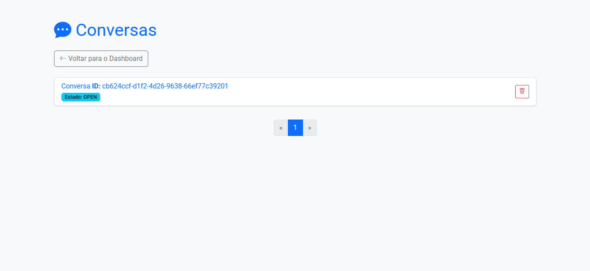

# 🚀 API Conversations

Uma poderosa e elegante API desenvolvida com **DjangoRestFramework**, seguindo as melhores práticas de segurança, testes, versionamento e deploy. Ideal para aplicações escaláveis e modernas.

---

## 🌐 Frontend da Aplicação

O frontend da aplicação pode ser acessado através do seguinte link:

🔗 **[Acessar Frontend](https://api-conversations.onrender.com/api/interface)**

## 🌐 Documentação

Acesse a documentação interativa da API no Swagger:

🔗 **[https://api-conversations.onrender.com/api/docs/](https://api-conversations.onrender.com/api/docs/)**

> ⚠️ *O projeto está hospedado na Render com plano gratuito (Free Tier), o que pode causar uma demora inicial de alguns segundos ao acessar após período de inatividade (cold start).*

---

## 🛠️ Tecnologias Utilizadas

- **[Python 3.13](https://www.python.org/)** – Linguagem de programação principal.
- **[SQLITE3](https://www.sqlite.org/)** – Banco de dados local para desenvolvimento.
- **[PostgreSQL](https://www.postgresql.org/)** – Banco de dados em produção.
- **[API Key](https://swagger.io/docs/specification/authentication/api-keys/)** – Autenticação segura via API key.
- **[Django](https://www.djangoproject.com/)** – Framework web utilizado para criar a API.
- **[Django Templates](https://docs.djangoproject.com/en/stable/topics/templates/)** – Utilizado para renderizar as páginas frontend, como a visualização de conversas e imóveis.
- **[djangorestframework](https://www.django-rest-framework.org/)** – Utilizado para facilitar a criação de APIs RESTful com Django.
- **[Sentry](https://sentry.io/)** – Monitoramento de erros em tempo real.
- **[GEMINI API](https://developers.google.com/search/blog/2022/05/introducing-gemini)** – API do Google para processamento de mensagens e busca de imóveis relacionados.
- **[Poetry](https://python-poetry.org/)** – Gerenciador de dependências e empacotamento para projetos Python.
---

## 📦 Como rodar o projeto com Docker

```bash
# Clone o projeto
git clone https://github.com/Marcos-Dantas22/api-conversations.git
cd api-conversations

# Gere o arquivo .env com as variáveis de ambiente
./setup.sh  # ou execute manualmente conforme abaixo

# Usuario admin disponivel em produção
username: useradmin
password: adminadmin
```

## Informações sobre o Desenvolvimento do Projeto
Este projeto consiste em uma API desenvolvida com Django + DjangoRestFramework + Poetry, utilizando SQLITE3 como banco de dados. A aplicação foi estruturada para atender aos requisitos de receber webhooks de um sistema de atendimento. Esses webhooks contêm eventos relacionados a conversas e mensagens, e devem ser registrados no banco de dados corretamente. Todos os endpoints foram cuidadosamente implementados, com validações adequadas e tratamento de erros para garantir a robustez da aplicação.

Além disso, foi implementada um frontend utilizando django templates, para visualizar as conversas e mensagens que são processadas.



Existe também uma pagina de imoveis de exemplo


Essa pagina serve como uma integração com uma funcionalidade de IA que eu adicionei utilizando o gemini do google, funciona da seguinte maneira: ao processar uma mensagem, se ela contem informações de busca de um imovel ela vai gerar uma instancia da classe LeadInfo, e ao entrar na pagina de imoveis, ele vai buscar pra cada imovel se existem instancias de LeadInfo relacionadas a algum imovel, utilizando o tipo de imovel, bairro e numero de quartos. Dessa forma vai aparecer sinalizada na pagina que aquele imovel tem alguem interessado e ao entrar nos detalhes do imovel vai mostrar o id da conversa que esta interessada.

A aplicação está hospedada na plataforma Render, o que pode ocasionar um pequeno tempo de espera na primeira requisição, já que o serviço entra em modo de inatividade depois de 15 min de inatividade para otimizar recursos. Porém, após a primeira requisição, a API transita para outro modo, garantindo que as requisições subsequentes sejam respondidas com o tempo normal de latência.
